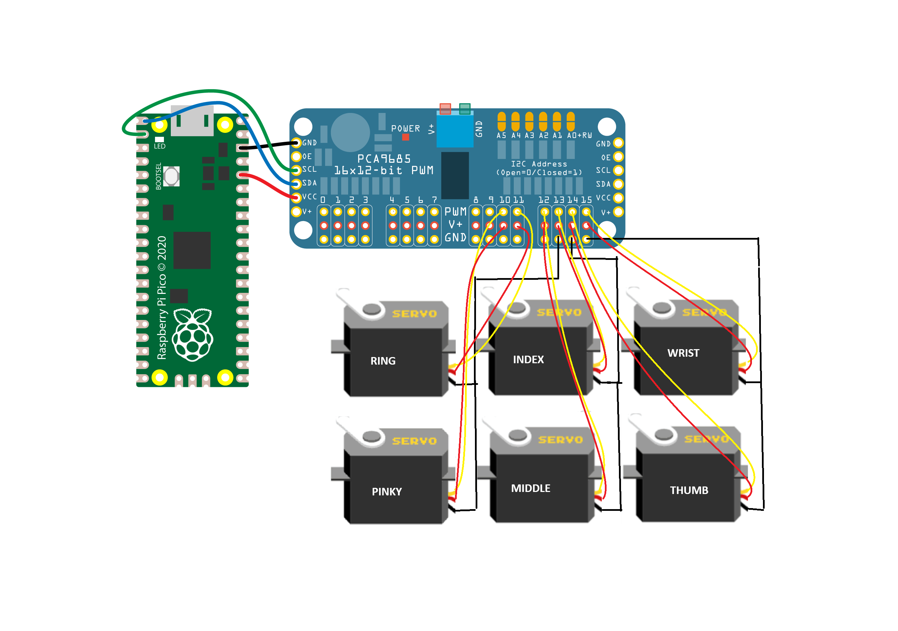

# 3D-Printed Arm Control

This is a repository to hold the main firmware, scripts, and demos for a Circuitpython-controlled microcontroller operating a 3D-printed robotic hand.


# Installation

## Hand & Forearm Build

The instructions for building your own arm can be found on the [Inmoov wesbite](https://inmoov.fr//hand-and-forarm/). The arm is designed to be 3D printed and assembled with servos and other components.

Wiring instructions can be found in the diagram below:




Note: Adjust the pin definitions in the `code.py` file to match the pins used if they are different that the wiring diagram.

## Raspberry Pico 2350 Setup

See [Getting Started with the Raspberry Pi Pico](https://rptl.io/pico-get-started) and the README in the [pico-sdk](https://github.com/raspberrypi/pico-sdk) for information
on getting up and running. These instructions should work with both Pico 1 and 2.

###  Configure the Raspberry Pico for Circuitpython (Skip if already done):

1. If this is the first time the Pico is used, or a new Circuitpython image is needed, enter bootloader mode by holding down the button on the Pico while plugging it into the computer. The Pico should show up as a USB drive named `RPI-RP2`, `CIRCUITPY`, or `BOOT`.
2. Move the pre-built Circuitpython UF2 file to the Pico drive. More recent UF2 file can be downloaded from the [Circuitpython website](https://circuitpython.org/board/raspberry_pi_pico/). 

### Install the Circuitpython Libraries:

1. Remove any files in the `lib` folder on the Pico and replace them with the contents of the `lib` folder in this repository.
2. Move the `code.py` file to the root of the Pico drive.

The code will automatically run when the Pico is powered on, like code flashed onto an Arduino.

# Demo

When the Pico is turned on, the script will wait for commands to be sent to perform gestures with the robotic hand. An example script is provided to send gesture commands to the robot arm. Connect to the Pico device by passing in the port name as an argument to the script. For windows devices the port is listed as a com device( e.g. `COM3`) and for linux devices it is listed as a tty device (e.g. `/dev/ttyACM0`).

   ```bash
   python gesture_test.py --port <port_name>
   ```
 
To send messages to the Pico using the pyserial library, open a terminal and connect to the device. You can send your own gesture commands! Below is the list of recognized gestures that the robotic hand can perform using the serial interface:

- `flex`: All fingers flex to a closed fist.
- `extend`: All fingers extend straight.
- `pronate`: Rotates the wrist downward.
- `supinate`: Rotates the wrist upward.
- `thumb`: Flexes only the thumb.
- `index`: Flexes only the index finger.
- `ring`: Flexes only the ring finger.
- `middle`: Flexes only the middle finger.
- `pinky`: Flexes only the pinky finger.
- `open`: Opens all fingers to a neutral position.
- `grip`: Closes all fingers tightly for a gripping motion.
- `pinch`: Flexes the thumb and index finger for a pinch gesture.
- `point`: Extends the index finger while flexing all other fingers.
- `spiderman`: Extends the index and middle fingers, as well as the pinky, while flexing the ring and thumb (Spiderman gesture).
- `rest`: Resets all fingers to the rest position.

Feel free to test these gestures with the robotic hand and modify them in the code.py file to suit your project requirements.
